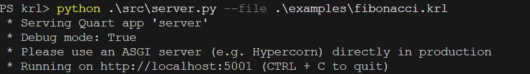
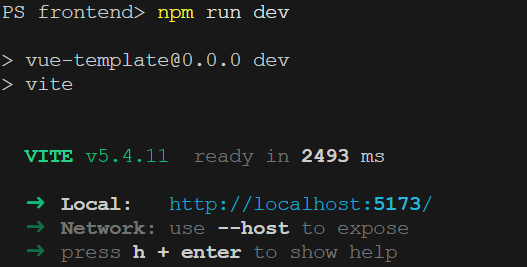
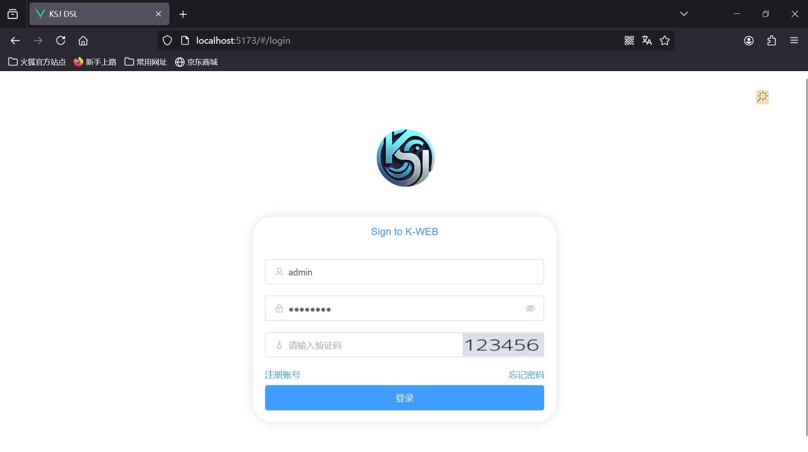
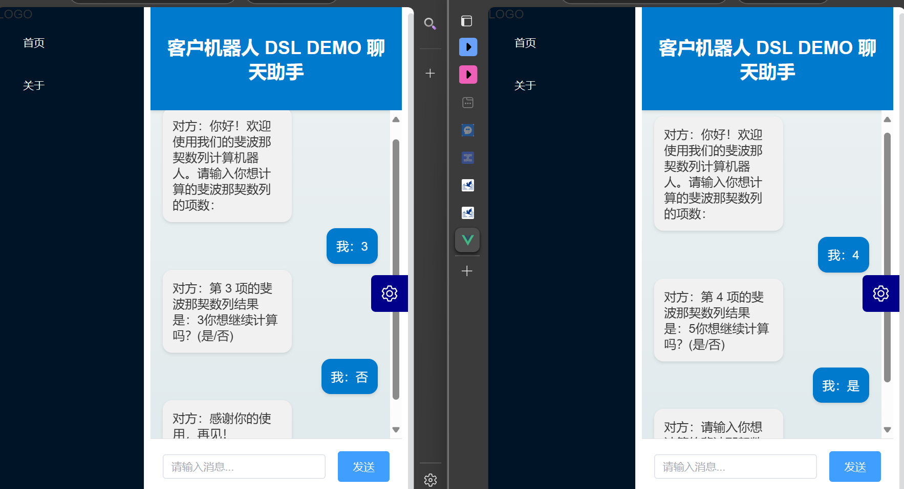
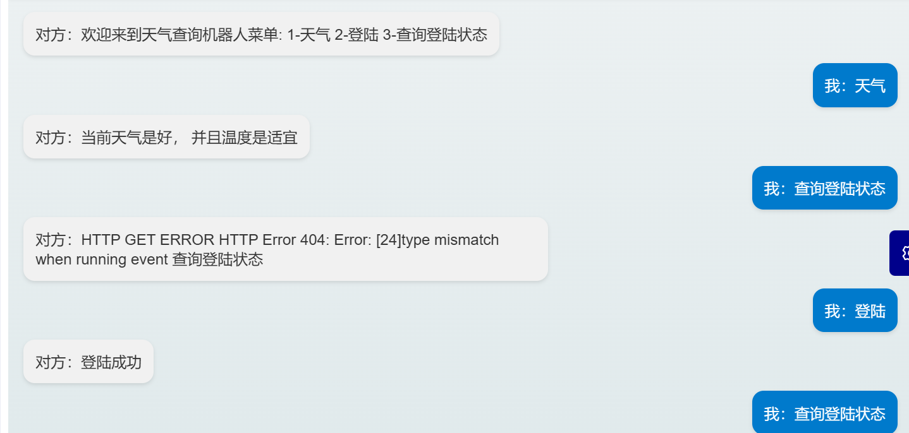
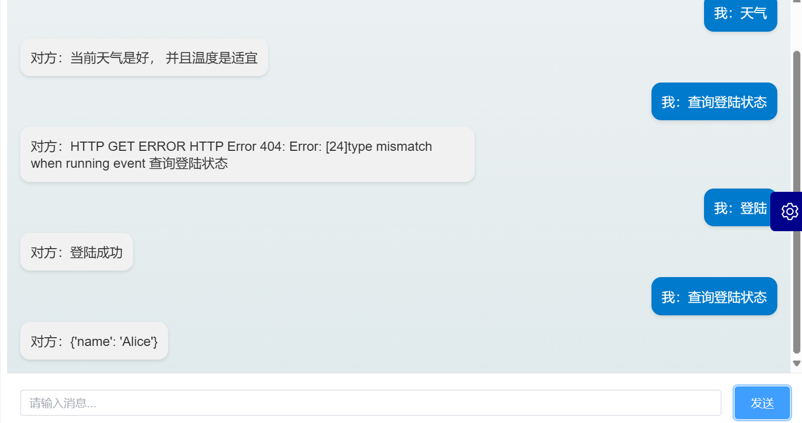
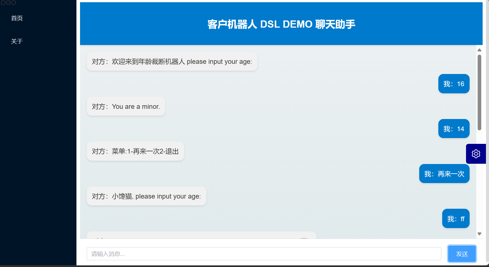
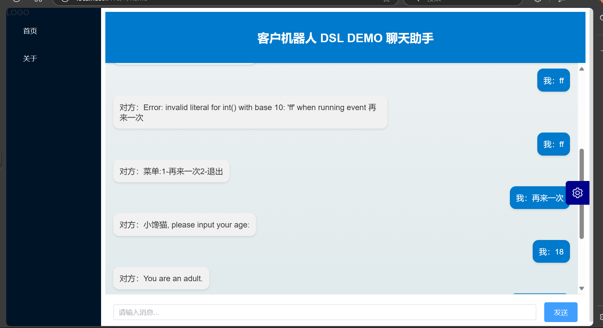
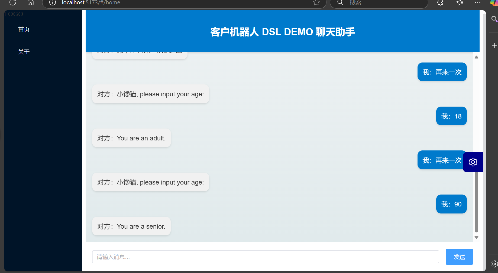
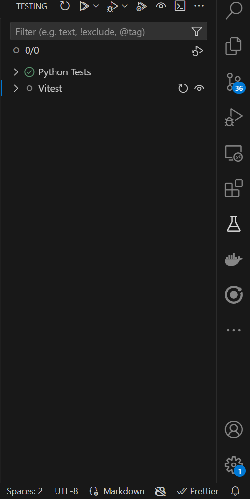

<div class="cover" style="page-break-after:always;font-family:仿宋;width:100%;height:100%;border:none;margin: 0 auto;text-align:center;">
    <div style="width:100%;margin: 0 auto;height:0;padding-bottom:40%;">
        
	</div>
    </br></br></br></br>
    <p style="text-align:center;font-size:24pt;margin: 0 auto">《程序设计实践》</p>
    </br></br></br></br>
    <p style="text-align:center;font-size:24pt;margin: 0 auto">实验报告</p>
	</br></br></br></br>
	</br></br>
    <table style="border:none;text-align:center;width:80%;font-family:仿宋;margin: 0 auto;">
    <tbody style="font-family:仿宋;font-size:16pt;">
    	<tr style="font-weight:bold;"> 
    		<td style="width:25%;text-align:right;">题&emsp;&emsp;目</td>
    		<td style="width:5%">：</td> 
    		<td style="font-weight:normal;border-bottom: 2px solid;text-align:center;">基于领域特定脚本语言的客服机器人的设计与实现</td>     </tr>
        <tr style="font-weight:bold;"> 
    		<td style="width:25%;text-align:right;">姓&emsp;&emsp;名</td>
    		<td style="width:5%">：</td> 
    		<td style="font-weight:normal;border-bottom: 2px solid;text-align:center;">宋健</td>     </tr>
    	<tr style="font-weight:bold;"> 
    		<td style="width:25%;text-align:right;">学&emsp;&emsp;号</td>
    		<td style="width:5%">：</td> 
    		<td style="font-weight:normal;border-bottom: 2px solid;text-align:center;">2022212702</td>     </tr>
        <tr style="font-weight:bold;"> 
    		<td style="width:25%;text-align:right;">班&emsp;&emsp;级</td>
    		<td style="width:5%">：</td> 
    		<td style="font-weight:normal;border-bottom: 2px solid;text-align:center;">2022211305</td>     </tr>
        <tr style="font-weight:bold;"> 
    		<td style="width:25%;text-align:right;">专&emsp;&emsp;业</td>
    		<td style="width:5%">：</td> 
    		<td style="font-weight:normal;border-bottom: 2px solid;text-align:center;">计算机科学与技术</td>     </tr>    	
    	<tr style="font-weight:bold;"> 
    		<td style="width:25%;text-align:right;">指导老师</td>
    		<td style="width:5%">：</td> 
    		<td style="font-weight:normal;border-bottom: 2px solid;text-align:center;">	闫丹凤，赵耀 </td>     </tr>
    </tbody>              
    </table>
		<p style="text-align:center;">2024 年 12 月 25 日</p>
</div>


---


[toc]

---

## 作业描述

领域特定语言（Domain Specific Language，DSL）可以提供一种相对简单的文法，用于特定领域的业务流程定制。本作业要求定义一个领域特定脚本语言，这个语言能够描述在线客服机器人（机器人客服是目前提升客服效率的重要技术，在银行、通信和商务等领域的复杂信息系统中有广泛的应用）的自动应答逻辑，并设计实现一个解释器解释执行这个脚本，可以根据用户的不同输入，根据脚本的逻辑设计给出相应的应答。

## 基本要求

- 脚本语言的语法可以自由定义，只要语义上满足描述客服机器人自动应答逻辑的要求。
- 程序输入输出形式不限，可以简化为纯命令行界面。
- 应该给出几种不同的脚本范例，对不同脚本范例解释器执行之后会有不同的行为表现。

## 评分标准

本作业考察学生规范编写代码、合理设计程序、解决工程问题等方面的综合能力。满分100分，具体如下：

- **风格**：满分15分，其中代码注释6分，命名6分，其它3分。 (见源码)
- **设计和实现**：满分30分，其中数据结构7分，模块划分7分，功能8分，文档8分。 (见文档)
- **接口**：满分15分，其中程序间接口8分，人机接口7分。 (将源码及文档)
- **测试**：满分30分，测试桩15分，自动测试脚本15分。 (见源码)
- **记法**：满分10分，文档中对此脚本语言的语法的准确描述。 (见文档)
## 实验环境
- windows 11
- python 3.11
- node 22.2
- npm 10.9
- git version 2.45.2.windows.1
## 提交文件

- 报告
- 程序源代码
- 可执行文件 （项目基于python,vue3。 均为脚本语言， 暂无可执行文件。）

注意：抄袭或有意被抄袭均为0分。
## 目录介绍及模块划分
```
.
├── README.md                   # 项目的总体介绍和使用说明
├── docs                        # 文档目录
│   ├── report.md               # 实验报告的Markdown版本
│   ├── report.pdf              # 实验报告的PDF版本
├── examples                    # 示例脚本目录
│   ├── eq.krl                  # 示例脚本，展示了基本的事件处理
│   ├── fibonacci.krl           # 示例脚本，展示了斐波那契数列的计算
│   ├── frontend                # 前端代码目录，包含Vue.js项目的代码
│   ├── server                  # wether脚本的api服务端代码目录，包含Quart服务器的代码
│   ├── simple.krl              # 示例脚本
│   ├── test_data_type.krl      # 示例脚本
│   └── weather.krl             # 示例脚本，展示了http请求的使用
├── requirements.txt            # 项目的依赖包列表
├── src                         # 源代码目录，包含项目的主要实现代码
│   ├── api_type.py             # API类型定义
│   ├── arg.py                  # 命令行参数解析
│   ├── config                  # 配置目录
│   ├── gen_krl.py              # KRL生成器
│   ├── interpreter             # 解释器模块
│   ├── lex.py                  # 词法分析器实现
│   ├── node                    # 节点模块
│   ├── parser.out              # 语法分析器输出
│   ├── parser.py               # 语法分析器实现
│   ├── parsetab.py             # 语法分析器表
│   ├── server.py               # 后端入口
│   ├── symbols                 # 符号表模块
│   ├── user.py                 # 用户实现
│   └── utils                   # 通用工具模块
├── tests                       # 测试目录，包含项目的测试代码
│   ├── conftest.py             # 测试配置
│   ├── server                  # 服务器测试目录
│   ├── test_node.py            # 节点测试实现
│   └── test_symbols.py         # 符号表测试实现
└── tmp                         # 临时目录，包含临时文件
```
### 模块划分
+ 词法分析器（lexer）：负责将输入字符串分割成标记（token）。
+ 语法分析器（parser）：负责将标记序列解析成抽象语法树（AST）。
+ 解释器（interpreter）：负责执行抽象语法树中的指令。
+ 符号表（symbols）：负责存储和管理符号信息。
+ 服务器（server）：提供API接口，处理用户请求。
+ 前端（frontend）：提供用户界面，允许用户与服务器进行交互。
+ 测试（tests）：包含项目的测试代码，确保各个模块的正确性和稳定性。
## 如何运行
在准备号[实验环境](#实验环境)后,进入项目主目录。
### 后端
- 安装依赖 ```pip install -r .\requirements.txt```
- 运行示例脚本(可换用其它脚本) ```python .\src\server.py --file .\examples\fibonacci.krl```

成功启动后结果如下：

### 前端DEMO
- 进入前端demo目录 ``` cd .\examples\frontend\```
- 安装依赖 ```npm i```
- 启动项目 ```npm run dev```
- 从web端进入```http://localhost:5173/```(端口号可能会变化)

启动成功后界面如下:

## 示例
- 账号: admin
- 密码: 123456
### fibonacci
后端启动方式
```
python .\src\server.py --file .\examples\fibonacci.krl
```
#### 脚本文件
```
# 计算斐波那契数列
event "start" {
  print("你好！欢迎使用我们的斐波那契数列计算机器人。");
  int n = get("请输入你想计算的斐波那契数列的项数：");
  int result = fbc(n);
  print("第 ${n} 项的斐波那契数列结果是：${result}");
  ask_again();
}

event "end" {
  print("感谢你的使用，再见！");
}
event "other" {
  print("无其它功能, 我们还是来算算斐波那契数列吧!");
  ask_again();
}

fn ask_again() {
  string choice = get("你想继续计算吗？(是/否)");
  if (choice == "是") {
    int n = get("请输入你想计算的斐波那契数列的项数：");
    int result = fbc(n);
    print("第 ${n} 项的斐波那契数列结果是：${result}");
    ask_again();
  } else if(choice == "否") {
    exit();
  } else {
    print("小淘气！不要乱输入哟~");
  }
}

fn fbc(int n) {
  if (n == 0 || n == 1) {
    return 1;
  }
  return fbc(n - 1) + fbc(n - 2);
}
```
#### 运行示例
同时多个用户运行


### wether
本示例包含http请求示例
#### 启动api server demo
```python .\examples\server\src\main.py```
脚本示例
```py
from quart import Quart, request, jsonify

app = Quart(__name__)

# 存储数据的简单字典
data_store = {}


@app.route('/data', methods=['POST'])
async def post_data():
  data = await request.json
  print("data is :",data)
  key = data.get('key')
  value = data.get('value')
  if key and value:
    data_store[key] = value
    return jsonify({"message": "Data stored successfully"}), 201
  else:
    return jsonify({"error": "Invalid data"}), 201

@app.route('/data/<key>', methods=['GET'])
async def get_data(key):
  value = data_store.get(key)
  if value:
    return jsonify({key: value}), 200
  else:
    return jsonify({"error": "Not found"}), 404

@app.route('/weather', methods=['GET'])
async def weather():
  return jsonify({"climate": "好", "temp":"适宜"}), 200


if __name__ == '__main__':
  app.run(host='0.0.0.0', port=5000, debug=True)
```
#### 启动后端
```
python .\src\server.py --file .\examples\weather.krl
```
脚本
```
event "start" {
  print("欢迎来到天气查询机器人");
  menu();
}
event "天气" {
  json res = hget("http://localhost:5000/weather");
  string climate = res.climate;
  string temp  = res.temp;
  print("当前天气是${climate}， 并且温度是${temp}");
}
event "登陆" {
  string post_url = "http://127.0.0.1:5000/data";
  string name = "Alice";
  string key = "name";
  json post_data = {
    "key": key,
    "value":name
  };
  hpost(post_url,post_data);
  print("登陆成功");
}
event "查询登陆状态" {
  string get_url = "http://127.0.0.1:5000/data/name";
  json res = hget(get_url);
  print("${res}");
}
event "other" {
  print("没有这个功能(⊙o⊙)");
  menu();
}
event "退出" {
  exit();
}
fn menu() {
  print("菜单:\n");
  print("  1-天气");
  print("  2-登陆");
  print("  3-查询登陆状态");
}
```
#### 运行示例


### simple
#### 后端启动方法
```
python .\src\server.py --file .\examples\simple.krl
```
脚本:
```
event "start" {
  print("欢迎来到年龄裁断机器人\n");
  int age = get("please input your age:\n");
  check_age(age);
}

fn check_age(int age) {
  if (age < 0) {
    print("Age cannot be negative. Please try again.");
    int new_age = get("please input your age:\n");
    check_age(new_age);
  } else if (age < 18) {
    print("You are a minor.");
  } else if (age < 65) {
    print("You are an adult.");
  } else {
    print("You are a senior.");
  }
}

event "再来一次" {
  int age = get("小馋猫, please input your age:\n");
  check_age(age);
}

event "退出" {
  exit();
}

event "other" {
  print("菜单:");
  print("1-再来一次");
  print("2-退出");
}
```
#### 运行示例



## **记法**

### 介绍

本客户机器人 DSL（领域特定语言）旨在描述在线客服机器人的自动应答逻辑。该语言提供了一种简单且直观的方式来定义事件、条件、循环、函数和变量，以便根据用户输入生成相应的响应。

### 关键字和保留字

DSL中的关键字和保留字用于定义语言的基本结构和控制流。以下是主要的关键字和保留字：

- **event**：定义事件。
- **if**：条件语句。
- **else**：条件语句的分支。
- **while**：循环语句。
- **return**：返回语句。
- **fn**：定义函数。

### 注释

DSL支持单行注释，使用 `#` 开头。注释用于在代码中添加说明和解释。

```krl
# 这是一个注释
```

### 类型

DSL支持以下基本类型：

- **int**：整数类型。
- **float**：浮点数类型。
- **string**：字符串类型。
- **json**：JSON对象类型。

### 变量

变量用于存储数据，可以在表达式中使用。变量的定义和赋值如下：

```krl
int x = 5;
float y = 3.14;
string name = "Alice";
json data = {"key": "value"};
```

### 表达式和运算符

DSL支持以下运算符：

- **算术运算符**：`+`、`-`、`*`、`/`
- **关系运算符**：`==`、`!=`、`<=`、`>=`、`<`、`>`
- **逻辑运算符**：`&&`、`||`、`!`
- **赋值运算符**：`=`

### 条件语句

条件语句用于根据条件执行不同的代码块。DSL支持 `if` 和 `else` 语句：

```krl
int x = 5;
if (x == 5) {
  print("x is 5");
} else {
  print("x is not 5");
}
```

### 循环语句

循环语句用于重复执行代码块。DSL支持 `while` 语句：

```krl
int x = 0;
while (x < 10) {
  print(x);
  x = x + 1;
}
```

### 函数

函数用于封装可重用的代码块。函数的定义和调用如下：

```krl
fn factorial(int n) {
  if (n == 0) {
    return 1;
  } else {
    return n * factorial(n - 1);
  }
}

int result = factorial(5);
print("Factorial of 5 is ${result}");
```

### 事件

事件用于定义特定的触发条件和响应逻辑, 输入对应的关键字能够触发事件（未来引入AI可以从自然语言中提取关键字）。事件的定义如下：

```krl
event "start" {
  print("Welcome to the chatbot!");
  int choice = get("Enter 1 for weather, 2 for news:");
  if (choice == 1) {
    trigger("weather");
  } else if (choice == 2) {
    trigger("news");
  } else {
    print("Invalid choice");
  }
}

event "weather" {
  print("The weather is sunny.");
}

event "news" {
  print("Today's news: ...");
}
```
### 内置函数和事件

DSL提供了一些内置函数和事件，用于处理常见的操作和事件。

#### 内置事件

- **start**：启动事件，在脚本开始执行时触发。
- **end**：结束事件，在脚本结束执行时触发。
- **other**：其他事件，用于处理未定义的事件。
##### 示例
```
event "start" {
  print("欢迎来到年龄裁断机器人\n");
  int age = get("please input your age:\n");
  check_age(age);
}

fn check_age(int age) {
  if (age < 0) {
    print("Age cannot be negative. Please try again.");
    int new_age = get("please input your age:\n");
    check_age(new_age);
  } else if (age < 18) {
    print("You are a minor.");
  } else if (age < 65) {
    print("You are an adult.");
  } else {
    print("You are a senior.");
  }
}

event "再来一次" {
  int age = get("小馋猫, please input your age:\n");
  check_age(age);
}

event "退出" {
  exit();
}

event "other" {
  print("菜单:");
  print("1-再来一次");
  print("2-退出");
}
```
#### 内置函数

- **print**：输出字符串到控制台。

  ```krl
  print("Hello, World!");
  ```

- **get**：获取用户输入，返回字符串。

  ```krl
  string name = get("Please enter your name:");
  ```

- **hget**：发送HTTP GET请求，返回响应字符串。

  ```krl
  string response = hget("https://api.example.com/data");
  ```

- **hpost**：发送HTTP POST请求，返回响应字符串。

  ```krl
  json data = {"key": "value"};
  string response = hpost("https://api.example.com/data", data);
  ```

- **exit**：退出脚本执行。

  ```krl
  exit();
  ```
### string 对象
支持format

```
int n = get("请输入你想计算的斐波那契数列的项数：");
  int result = fbc(n);
  print("第 ${n} 项的斐波那契数列结果是：${result}");
```
### JSON 对象

DSL支持JSON对象，用于存储结构化数据。JSON对象的定义如下：

```krl
json data = {
  "name": "Alice",
  "age": 30,
  "address": {
    "city": "Wonderland",
    "street": "Rabbit Hole"
  }
};
```

注: 本脚本不支持完整的JSON 对象的所有功能， 仅支持部分功能
### 示例脚本

以下是几个示例脚本，展示了DSL的基本语法和功能：

#### 示例1：简单算术运算

```krl
int x = 3 + 4 * 10;
print(x);
```

#### 示例2：条件语句

```krl
int x = 5;
if (x == 5) {
  print("x is 5");
} else {
  print("x is not 5");
}
```

#### 示例3：循环语句

```krl
int x = 0;
while (x < 10) {
  print(x);
  x = x + 1;
}
```

#### 示例4：函数调用

```krl
fn factorial(int n) {
  if (n == 0) {
    return 1;
  } else {
    return n * factorial(n - 1);
  }
}

int result = factorial(5);
print("Factorial of 5 is ${result}");
```

#### 示例5：事件处理

```krl
event "start" {
  print("Welcome to the chatbot!");
  int choice = get("Enter 1 for weather, 2 for news:");
  if (choice == 1) {
    trigger("weather");
  } else if (choice == 2) {
    trigger("news");
  } else {
    print("Invalid choice");
  }
}

event "weather" {
  print("The weather is sunny.");
}

event "news" {
  print("Today's news: ...");
}
```

### 结论

本DSL通过提供简单且直观的语法，能够有效地描述在线客服机器人的自动应答逻辑。通过示例脚本展示了DSL的基本语法和功能，证明了其在描述客服机器人自动应答逻辑方面的有效性。
## 设计与实现

### 数据结构

在本项目中，主要的数据结构包括抽象语法树（AST）节点、符号表、解释器状态等。以下是主要的数据结构定义：

- **Node**：表示抽象语法树中的节点，包含节点类型、名称、值、子节点列表、行号和位置等属性。
- **StackListSymbolTable**：符号表，使用栈列表结构存储符号信息。
- **Interpreter**：解释器类，负责执行脚本，维护全局和运行时符号表，处理输入输出缓冲区等。

### 模块划分

项目主要分为以下几个模块：

- **lexer**：词法分析器，负责将输入字符串分割成标记（token）。
- **parser**：语法分析器，负责将标记序列解析成抽象语法树。
- **interpreter**：解释器，负责执行抽象语法树中的指令。
- **server**：服务器，提供API接口，处理用户请求。
- **user**：用户类，表示使用KRL语言的用户，包含用户ID和解释器实例。

### 功能

项目实现了以下主要功能：

- **词法分析**：将输入字符串分割成标记。
- **语法分析**：将标记序列解析成抽象语法树。
- **脚本执行**：解释器执行抽象语法树中的指令，处理输入输出。
- **API接口**：提供创建用户和运行脚本的API接口。

## 接口

### 程序间接口

项目通过API接口提供服务，主要包括以下两个接口：

- **创建用户**：`/create_user`，http post 请求，创建一个新的用户，并返回用户ID和初始输出。
- **运行脚本**：`/run`，http post 请求，根据用户ID和输入字符串运行脚本，并返回输出结果。

### 人机接口

项目提供了一个简单的前端界面，用户可以通过该界面与服务器进行交互，发送输入并接收输出。

当然，也可以通过其它方法向后端发送post请求访问。

## 测试

项目使用pytest框架进行测试，测试覆盖了主要功能，包括词法分析、语法分析、脚本执行和API接口。测试代码位于`tests`目录下。

### 测试桩

未来会引入AI,但暂未实现，故而先用测试桩代替

file: ```src\interpreter\mod.py```

```py
def generate_text(self, text: str) -> str:
    '''
    通过NLP生成用户请求文本
    '''
    return text
```
### 自动测试脚本

自动测试脚本使用pytest框架编写，确保项目的主要功能正常工作。




## 示例脚本

以下是几个示例脚本，展示了KRL脚本语言的基本语法和功能：

### 示例1：简单算术运算

```krl
int x = 3 + 4 * 10;
print(x);
```

### 示例2：条件语句

```krl
int x = 5;
if (x == 5) {
  print("x is 5");
} else {
  print("x is not 5");
}
```

### 示例3：循环语句

```krl
int x = 0;
while (x < 10) {
  print(x);
  x = x + 1;
}
```

### 示例4：函数调用

```krl
fn factorial(int n) {
  if (n == 0) {
    return 1;
  } else {
    return n * factorial(n - 1);
  }
}

int result = factorial(5);
print("Factorial of 5 is ${result}");
```

### 示例5：事件处理

```krl
event "start" {
  print("Welcome to the chatbot!");
  int choice = get("Enter 1 for weather, 2 for news:");
  if (choice == 1) {
    trigger("weather");
  } else if (choice == 2) {
    trigger("news");
  } else {
    print("Invalid choice");
  }
}

event "weather" {
  print("The weather is sunny.");
}

event "news" {
  print("Today's news: ...");
}
```

## 结论

本项目通过设计和实现一个领域特定脚本语言，展示了DSL在特定领域业务流程定制中的应用。项目实现了词法分析、语法分析、脚本执行和API接口等功能，并通过测试验证了其正确性和稳定性。通过示例脚本展示了KRL脚本语言的基本语法和功能，证明了其在描述客服机器人自动应答逻辑方面的有效性。


## 附录

### 项目概述

- **日期**: 2024-12-20 11:18:03
- **目录**: c:\\Users\\21756\\Desktop\\krl
- **文件总数**: 129
- **代码行数**: 14,670
- **注释行数**: 352
- **空行数**: 545
- **总行数**: 15,567

### 语言统计

| 语言 | 文件数 | 代码行数 | 注释行数 | 空行数 | 总行数 |
| :--- | ---: | ---: | ---: | ---: | ---: |
| JSON | 6 | 10,797 | 0 | 8 | 10,805 |
| Python | 30 | 1,486 | 59 | 221 | 1,766 |
| Vue | 32 | 1,109 | 47 | 108 | 1,264 |
| TypeScript | 35 | 782 | 190 | 90 | 1,062 |
| SCSS | 14 | 276 | 53 | 38 | 367 |
| Markdown | 4 | 143 | 0 | 73 | 216 |
| 其他 | 8 | 77 | 3 | 7 | 87 |

### 目录结构

| 路径 | 文件数 | 代码行数 | 注释行数 | 空行数 | 总行数 |
| :--- | ---: | ---: | ---: | ---: | ---: |
| . | 129 | 14,670 | 352 | 545 | 15,567 |
| examples | 97 | 13,064 | 294 | 278 | 13,636 |
| src | 24 | 1,370 | 51 | 190 | 1,611 |
| tests | 5 | 90 | 7 | 22 | 119 |

### 详细信息

- **docs**: 包含项目文档。
- **examples**: 包含前端和服务器的示例代码。
- **src**: 包含项目的主要源代码。
- **tests**: 包含测试代码。

详细信息请参见 [Details](details.md) 和 [Diff Summary](diff.md)。
